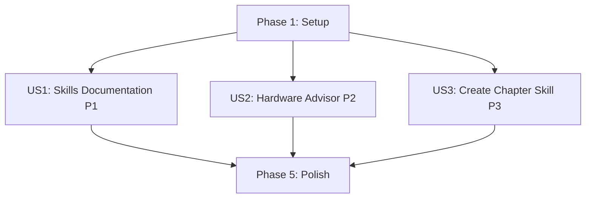

# Tasks: Reusable Intelligence Enhancement

**Feature**: `013-reusable-intelligence-enhancement`
**Branch**: `013-reusable-intelligence-enhancement`
**Spec**: [spec.md](./spec.md) | **Plan**: [plan.md](./plan.md)

## Summary

Enhance Claude Code reusable intelligence infrastructure by creating comprehensive documentation and additional agents/skills to achieve 50/50 gamification points. This is a **documentation-focused feature** with no executable code - only JSON configurations (agents) and Markdown documentation (skills).

**Key Deliverables**:
- `.claude/skills/README.md` - Comprehensive skills documentation
- `.claude/agents/README.md` - Enhanced agents documentation
- `hardware-advisor.json` - New agent for hardware recommendations
- `create-chapter.md` - New skill for MDX scaffolding

**Target**: 50/50 Reusable Intelligence points = 250/250 total points ✅

---

## Implementation Strategy

### MVP Scope (User Story 1 Only)
**Minimum Viable Product**: Just US1 (Skills Documentation) delivers immediate value
- Developers can discover and use existing `deploy-book` skill
- Documentation enables adoption of current reusable intelligence
- Independently testable: Read `.claude/skills/README.md` and verify completeness

### Incremental Delivery
1. **US1 (P1)**: Skills documentation → Enables skill discovery
2. **US2 (P2)**: Hardware advisor agent → Adds new capability
3. **US3 (P3)**: Create chapter skill → Accelerates content creation

Each story is independently deployable and testable.

---

## Dependencies

### User Story Completion Order

**All user stories are INDEPENDENT** - can be implemented in parallel after Setup phase.

### Inter-Story Dependencies
- None - all stories are fully independent
- US2 and US3 can start immediately after Setup
- US1 documentation references US2/US3 artifacts, so US1 might benefit from completing US2/US3 first, but not required

---

## Parallel Execution Opportunities

### User Story 1 (Skills Documentation)
**Parallelizable Tasks**: T004, T005 (both write different README sections)

### User Story 2 (Hardware Advisor)
**Parallelizable Tasks**: T007, T008 (research + JSON creation can overlap)

### User Story 3 (Create Chapter Skill)
**Parallelizable Tasks**: T010, T011 (template analysis + skill doc creation)

**Maximum Parallelism**: Up to 3 tasks can run simultaneously (one per user story after setup).

---

## Phase 1: Setup & Prerequisites

**Goal**: Prepare project structure and gather research data

**Duration**: ~2 hours

### Tasks

- [ ] T001 Create feature documentation structure in specs/013-reusable-intelligence-enhancement/
- [ ] T002 Research hardware pricing data from humanoid_robot_book/docs/02-hardware-requirements.mdx
- [ ] T003 Analyze existing agent structure from .claude/agents/book-rag-helper.json

**Acceptance Criteria**:
- [ ] specs/013-reusable-intelligence-enhancement/ directory exists with plan.md and spec.md
- [ ] Hardware pricing table compiled (GPU: $2000+, Jetson: $700, Cloud: $180/quarter)
- [ ] Agent JSON structure documented (required fields: name, description, capabilities, tools, systemPrompt, examples, tags)

---

## Phase 2: User Story 1 - Skills Documentation (P1)

**Story Goal**: Enable developers to discover and use available skills within 2 minutes

**Why P1**: Documentation is foundation for adoption - without it, existing skills go unused

**Independent Test Criteria**:
✅ Read `.claude/skills/README.md` and verify:
- Complete list of all skills with descriptions
- Usage examples for each skill
- Prerequisites clearly stated
- Troubleshooting section exists
- When-to-use guidance provided

**Test Execution**: Manual review - open README and check completeness against spec FR-002

### Tasks

- [ ] T004 [P] [US1] Write Skills Overview section in .claude/skills/README.md
- [ ] T005 [P] [US1] Document deploy-book skill with usage examples in .claude/skills/README.md
- [ ] T006 [US1] Add troubleshooting and best practices sections to .claude/skills/README.md

**Acceptance Criteria**:
- [ ] `.claude/skills/README.md` exists with 300-400 lines
- [ ] `deploy-book` skill fully documented with prerequisites, steps, success criteria, troubleshooting
- [ ] Quick Start section with copy-paste examples
- [ ] Table comparing when to use skills vs manual workflows
- [ ] Renders correctly in GitHub/VS Code

**Files Modified**:
- `.claude/skills/README.md` (CREATE ~350 lines)

---

## Phase 3: User Story 2 - Hardware Advisor Agent (P2)

**Story Goal**: Provide budget-based hardware recommendations to students/educators

**Why P2**: High-impact for users making hardware purchases; reduces barriers to course entry

**Independent Test Criteria**:
✅ Invoke hardware-advisor agent with 3 test scenarios:
1. "$500 budget student" → Returns Jetson Orin Nano setup with component list (~$700 actual)
2. "$10k budget for 20 students" → Returns mixed GPU + Jetson approach
3. "Mac user" → Returns cloud/Docker alternatives

**Test Execution**: Use Claude Code to invoke `@hardware-advisor` with each scenario; verify recommendations match hardware pricing data

### Tasks

- [ ] T007 [P] [US2] Research hardware recommendation logic and create pricing table
- [ ] T008 [P] [US2] Create hardware-advisor.json agent configuration in .claude/agents/
- [ ] T009 [US2] Test hardware-advisor with 3 budget scenarios and validate recommendations

**Acceptance Criteria**:
- [ ] `hardware-advisor.json` exists with valid JSON structure
- [ ] Agent includes 3+ usage examples in config
- [ ] SystemPrompt references budget ranges: <$500 (Cloud), $500-$2000 (Jetson), $2000+ (GPU)
- [ ] Agent considers user's existing hardware (as specified in FR-006)
- [ ] Cost accuracy within $50 of manual research (SC-002)
- [ ] Responds within 10 seconds (SC-002)

**Files Modified**:
- `.claude/agents/hardware-advisor.json` (CREATE ~80 lines)

---

## Phase 4: User Story 3 - Create Chapter Skill (P3)

**Story Goal**: Scaffold new MDX chapters with proper structure to accelerate content creation

**Why P3**: Valuable for ongoing maintenance but less critical than documentation (P1) and hardware guidance (P2)

**Independent Test Criteria**:
✅ Follow create-chapter skill documentation to generate test file:
1. Create new file using skill template
2. Fill in frontmatter (title: "Test Chapter", position: 99)
3. Add sample content to ContentVariant blocks
4. Run `npm run build` in humanoid_robot_book/
5. Verify build succeeds with no errors

**Test Execution**: Manual - create test MDX file, build Docusaurus, verify no errors

### Tasks

- [ ] T010 [P] [US3] Analyze existing MDX chapter structure from humanoid_robot_book/docs/*.mdx files
- [ ] T011 [P] [US3] Create create-chapter.md skill documentation in .claude/skills/
- [ ] T012 [US3] Test MDX template by creating sample chapter and building Docusaurus

**Acceptance Criteria**:
- [ ] `create-chapter.md` exists in `.claude/skills/` (~150 lines)
- [ ] Skill includes complete MDX template with:
  - Frontmatter (id, title, sidebar_label, sidebar_position)
  - Required imports (TranslationToggle, PersonalizeButton, ContentVariant)
  - ContentVariant blocks for all 3 hardware types (gpu_workstation, edge_device, cloud_or_mac)
  - TODO comments guiding content authors
- [ ] Template builds without errors in Docusaurus (SC-003)
- [ ] Success criteria and example output documented

**Files Modified**:
- `.claude/skills/create-chapter.md` (CREATE ~150 lines)

---

## Phase 5: Polish & Cross-Cutting Concerns

**Goal**: Finalize documentation, validate gamification points, ensure quality

**Duration**: ~1 hour

### Tasks

- [ ] T013 [P] Enhance .claude/agents/README.md with hardware-advisor documentation
- [ ] T014 [P] Update .claude/agents/book-rag-helper.json with additional usage examples
- [ ] T015 Validate all JSON files parse correctly (run JSON linter)
- [ ] T016 Verify all Markdown renders correctly in GitHub
- [ ] T017 Test end-to-end: invoke both agents, reference both skills
- [ ] T018 Calculate gamification points and verify 50/50 achieved

**Acceptance Criteria**:
- [ ] `.claude/agents/README.md` updated with ~400 total lines
- [ ] `book-rag-helper.json` has 3+ usage examples (was 2)
- [ ] All JSON files valid (no parse errors)
- [ ] All Markdown renders without formatting issues
- [ ] Agents respond correctly when invoked
- [ ] Skills documentation is complete and actionable
- [ ] **Gamification Verification**:
  - ✅ 2 agents (book-rag-helper + hardware-advisor)
  - ✅ 2 skills (deploy-book + create-chapter)
  - ✅ Comprehensive documentation (2 READMEs with examples, troubleshooting, when-to-use)
  - ✅ **Result: 50/50 points** → **Total: 250/250 points** ✅

**Files Modified**:
- `.claude/agents/README.md` (UPDATE +50 lines)
- `.claude/agents/book-rag-helper.json` (UPDATE +20 lines)

---

## Task Summary

**Total Tasks**: 18
- Setup Phase: 3 tasks
- User Story 1 (P1): 3 tasks
- User Story 2 (P2): 3 tasks
- User Story 3 (P3): 3 tasks
- Polish Phase: 6 tasks

**Parallelizable Tasks**: 8 tasks marked [P]

**Estimated Effort**:
- Setup: 2 hours
- US1: 3-4 hours
- US2: 2-3 hours
- US3: 2-3 hours
- Polish: 1 hour
- **Total: 10-13 hours**

---

## Testing Strategy

**No Automated Tests** - This is a documentation feature. All testing is manual verification.

### Test Scenarios

#### TS-001: Skills Documentation Completeness (US1)
**Given**: A developer opens `.claude/skills/README.md`
**When**: They read the documentation
**Then**: They find complete information for both skills (deploy-book, create-chapter)
**Verify**: Manual review against FR-002 checklist

#### TS-002: Hardware Advisor Low Budget (US2)
**Given**: A student with $500 budget
**When**: They invoke `@hardware-advisor I have $500, what should I buy?`
**Then**: Agent recommends Cloud/Mac + Docker approach with cost estimate
**Verify**: Response includes specific recommendations within $50 accuracy

#### TS-003: Hardware Advisor Medium Budget (US2)
**Given**: A student with $1500 budget
**When**: They invoke `@hardware-advisor I have $1500 for this course`
**Then**: Agent recommends Jetson Orin Nano + sensors setup (~$700-800)
**Verify**: Response includes component list and total cost

#### TS-004: Create Chapter Template (US3)
**Given**: Content creator wants to add new chapter
**When**: They follow create-chapter skill documentation
**Then**: Generated MDX file builds without errors
**Verify**: Run `npm run build` in humanoid_robot_book/ directory

#### TS-005: Gamification Points (Polish)
**Given**: All tasks completed
**When**: Project is audited for Reusable Intelligence points
**Then**: Verify 2 agents + 2 skills + comprehensive docs = 50/50 points
**Verify**: Manual checklist against gamification requirements

---

## Success Metrics

### Phase-Level Success

**Setup Complete When**:
- [ ] Hardware pricing table compiled
- [ ] Agent JSON structure understood
- [ ] Feature directory structure ready

**US1 Complete When**:
- [ ] `.claude/skills/README.md` exists and is complete
- [ ] Developer can discover all skills within 2 minutes (SC-001)
- [ ] All skills documented with examples and troubleshooting

**US2 Complete When**:
- [ ] `hardware-advisor.json` agent functional
- [ ] Recommendations accurate within $50 (SC-002)
- [ ] Responds within 10 seconds (SC-002)
- [ ] 3 test scenarios pass

**US3 Complete When**:
- [ ] `create-chapter.md` skill documented
- [ ] Template generates valid MDX (SC-003)
- [ ] Test chapter builds without errors

**Polish Complete When**:
- [ ] All documentation reviewed and polished
- [ ] All JSON/Markdown validated
- [ ] **50/50 Reusable Intelligence points achieved (SC-005)** ✅
- [ ] **Project total: 250/250 points** ✅

---

## Risk Mitigation

| Risk | Task | Mitigation |
|------|------|------------|
| Agent systemPrompts too long | T008 | Keep prompts <500 words; test with long queries |
| Hardware prices outdated | T007 | Include "last updated: 2025-12-23" in agent config |
| Skills don't work cross-platform | T011, T012 | Test documentation on Windows (current), verify portable commands |
| Documentation too verbose | T004, T005 | Use bullet points, clear headings, Quick Start sections |
| JSON parse errors | T015 | Validate with `python -m json.tool` before committing |

---

## Next Actions

1. **Start with Setup Phase** (T001-T003) - gather research data
2. **Implement US1** (T004-T006) - skills documentation for immediate value
3. **Parallel US2 + US3** (T007-T012) - can work on both simultaneously
4. **Polish** (T013-T018) - finalize and validate

**Ready to Begin**: ✅ All planning complete, tasks clearly defined

**Suggested First Command**: Implement T001-T003 (Setup Phase)

---

**Tasks Status**: ✅ READY FOR IMPLEMENTATION
**Branch**: `013-reusable-intelligence-enhancement`
**Next Step**: `/sp.implement` or manual task execution
